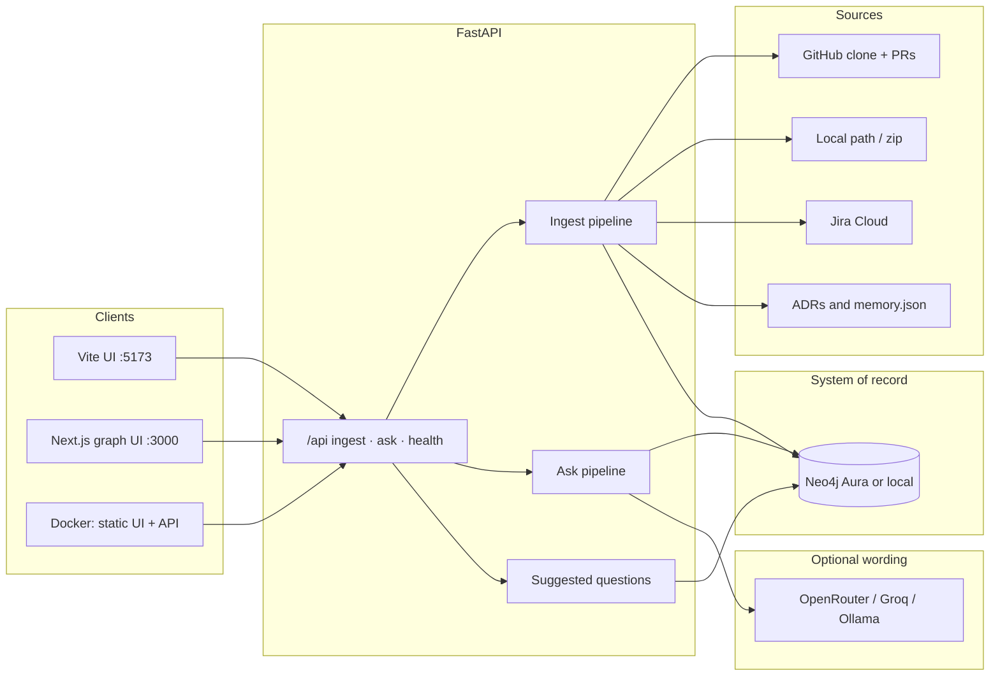
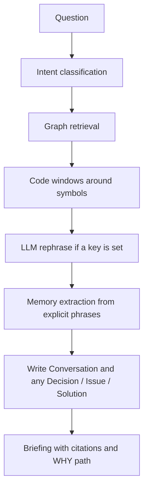
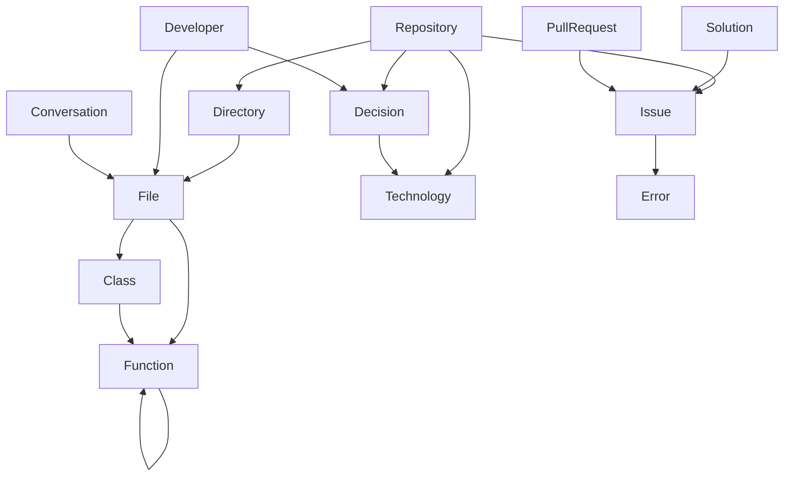

# DevMind

DevMind remembers a repository as a **graph**, then answers from that graph.

Neo4j is the system of record. A briefing is a walk over files, functions, decisions, issues, and pull requests — not a chat transcript with a database behind it.

It answers two kinds of questions:

- **What** does the code do? Files, classes, functions, calls, imports, technologies.
- **Why** does the project work this way? Decisions, issues, errors, solutions, pull requests, developers, and earlier conversations.

If the graph has no recorded reason, the briefing says so. The model does not invent a rationale.

---

# ScreenShots


## How it works

1. **Ingest** a GitHub URL, a local folder, a zip, or the bundled billing sample.
2. DevMind scans the tree, parses symbols, reads ADRs and `.devmind/memory.json`, and optionally pulls GitHub PRs and Jira tickets.
3. That document is written to **Neo4j**.
4. After a repo loads, the UI offers **suggested questions** from that repo’s functions, decision titles, and Jira keys — not a shared list.
5. **Ask** walks the graph, optionally rephrases with an LLM, and stores the briefing back as a Conversation.

Code structure is rebuilt on every ingest. Decisions you record in the UI (`source: user`) stay.

---

## Architecture



### Ask pipeline

Each question runs the same sequence. Graph facts are collected before the model speaks.



The WHY path, when the graph has one, is:

`Technology → Decision → Issue → Solution → Pull request`

### Repository graph



| Node | What it remembers |
| --- | --- |
| Repository | The ingested project |
| Directory, File | Tree, language, docstring, imports |
| Class, Function | Definitions, signatures, line numbers, calls |
| Technology | Libraries and runtimes from manifests and imports |
| Decision | ADR, `.devmind/memory.json`, or a decision recorded in the UI |
| Issue, Error, Solution | Incidents and the fix |
| PullRequest | Change set and author |
| Developer | Git authors, PR authors, deciders |
| Conversation, Message | A briefing written back, linked to the nodes it used |

Relationships include `CONTAINS`, `DEFINES`, `CALLS`, `IMPORTS`, `EXTENDS`, `USES`, `HAS_ISSUE`, `HAS_PR`, `CAUSED`, `CHOOSES`, `INFORMS`, `CLOSES`, `ABOUT`, `DECIDED_BY`, `SUPERSEDES`, `AFFECTS`, `OCCURS_IN`, `RESOLVES`, `CHANGES`, `AUTHORED_BY`, `AUTHORED`, `WORKS_ON`, `IN_REPOSITORY`, and `HAS_MESSAGE`.

### Layout on disk

| Path | Role |
| --- | --- |
| `frontend/` | Vite React UI (briefings, files, memory, suggested questions) |
| `web/` | Next.js console with an interactive graph |
| `backend/` | FastAPI, ingest, Neo4j store, ask agent |
| `examples/billing-service/` | Sample repo with ADRs and memory |
| `docs/adr/` | DevMind’s own architecture decisions |

Production Docker builds the Vite UI and serves it from the same origin as `/api`.

---

## Memory (what is automatic vs recorded)

**Automatic on ingest:** files, functions, calls, imports, technologies, git authors, GitHub pull requests, Jira tickets (when configured).

**Recorded reasons (needed for why):** ADRs under `docs/adr/` or `docs/decisions/`, `.devmind/memory.json`, the **Record a decision** form, or an explicit sentence in Ask:

- `remember that we decided … because …`
- `issue BILL-14: …`
- `we resolved BILL-14 by …`

The model does not invent those nodes.

---

## Run it locally

Copy `.env.example` to `.env`. Point `NEO4J_URI` at Neo4j Aura (`neo4j+s://…`) or a local instance. Aura uses `NEO4J_USERNAME`. The password stays in `.env`; that file is gitignored.

**Neo4j** (optional if you use Aura):

```bash
docker compose up -d
```

**API** (from `backend`):

```bash
python -m venv .venv
.venv\Scripts\activate
pip install -r requirements-dev.txt
uvicorn app.main:app --reload --host 127.0.0.1 --port 8000
```

On macOS or Linux: `source .venv/bin/activate`.

**UI** (from `frontend`):

```bash
npm install
npm run dev
```

Open `http://127.0.0.1:5173`.

**Graph console** (from `web`):

```bash
npm install
npm run dev
```

Open `http://127.0.0.1:3000`.

Connect a GitHub repo in the UI (`GITHUB_TOKEN` for private repos). Zip upload: `POST /api/ingest/upload`.

Jira Cloud: set `JIRA_BASE_URL`, `JIRA_EMAIL`, `JIRA_API_TOKEN`, and `JIRA_PROJECT`, then ingest the matching repository. Tickets become Issue nodes (and Solution nodes when Done). Do not put a Jira token in `GITHUB_TOKEN`.

Optional wording model (OpenAI-compatible). Leave unset and the briefing is still produced from the graph:

```bash
DEVMIND_LLM_BASE_URL=http://localhost:11434/v1
DEVMIND_LLM_API_KEY=ollama
DEVMIND_LLM_MODEL=llama3.1
```

The API reads local directories and listens on `127.0.0.1` by default. Ingest refuses more than 8,000 files.

---

## Try the billing sample

In the UI, load the billing sample. Suggested questions should include names from that graph. You can also ask:

- What does `calculate_tax` do?
- Why are amounts stored in integer cents?
- Why is `apply_payment` safe to retry?

The sample has integer-cent and floating-point decisions, a resolved webhook issue, the `IntegrityError` it caused, the solution, and pull request 38.

**Ingest DevMind** loads this repository, including ADRs under `docs/adr` and `.devmind/memory.json`.

CLI:

```bash
python -m app.ingest.cli --path ..\examples\billing-service --name "Billing Service"
```

---

## Project memory you add later

A useful ADR:

```markdown
# Store money as integer cents

Status: accepted
Date: 2024-02-12
Deciders: Lena Ortiz
Supersedes: 0000-use-floating-point-dollars

## Context
Invoice totals drifted.

## Decision
All monetary amounts are integer cents.

## Consequences
Format currency at the edge.

Affects: app/pricing.py, calculate_tax
```

Issues, errors, solutions, and pull requests also live in `.devmind/memory.json`. See `examples/billing-service/.devmind/memory.json`.

The **Record a decision** form writes a `Decision` node immediately. The next why-question can find it by the words in the title and rationale.

---

## Deploy

One Docker image serves the UI and `/api` on the same origin. Point it at **Neo4j Aura** and **OpenRouter** with the same keys you use locally. Never put `.env` in git.

### Local production image

```bash
docker compose -f docker-compose.prod.yml up --build
```

Open `http://127.0.0.1:8000`. GitHub clones are stored in a Docker volume.

### Render

1. Push this repo to GitHub.
2. New Web Service → this repository → Docker (or Blueprint: `render.yaml`).
3. Set `NEO4J_URI`, `NEO4J_PASSWORD`, `OPENROUTER_API_KEY`.
4. If the UI is ever hosted separately, set `DEVMIND_CORS_ORIGINS` to that origin. Same-origin Docker does not need it.

Railway, Fly, and other Docker hosts inject `PORT`; the image binds `0.0.0.0:$PORT`.

Ask timeouts can exceed 30s on free models. Raise the platform request timeout if Ask is cut off.

---

## Tests

From `backend`:

```bash
pytest
```

The unit tests cover parsing, the billing-service graph document, what/why classification, suggested questions, and the rule that a model cannot invent a rationale. They do not require Neo4j.
